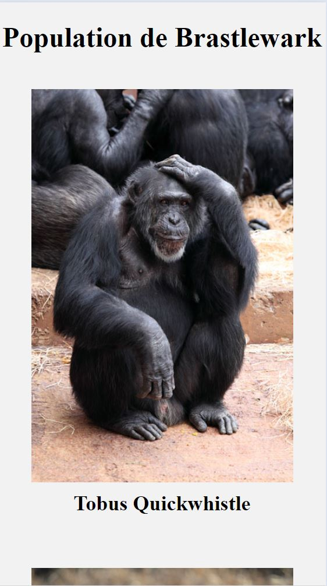
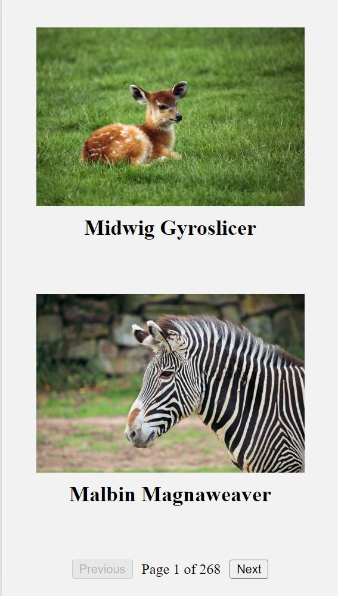
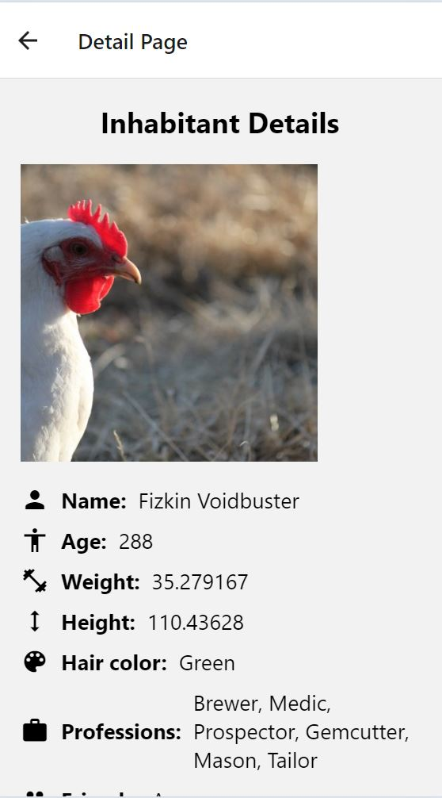
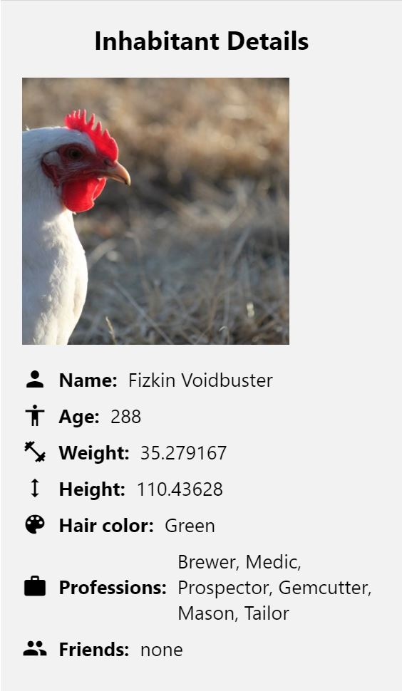

# Project Name

Gnomeville is a mobile application developed using React Native and Expo Go. It serves as a platform to explore the inhabitants of a fictional town called Gnomeville. The app consists of two main pages: one to view all the inhabitants and another to navigate by clicking on the photo of an inhabitant to view detailed information about them.

## Installation
- npm install -g expo-cli   
- npx expo install react-dom react-native-web @expo/webpack-config
- npm install expo@^49.0.0
- npx expo install --fix
More information can be found in the Expo Go documentation : https://docs.expo.dev/get-started/expo-go/

## Usage
- expo start 
- To launch the app on your mobile device:
If you want to launch it with your phone, you need to install the Expo Go app and then scan the QR code with the camera, if you are on iOS, otherwise on Android it will be on the Expo Go app.

- To launch the app on the web:
You can launch it on the web by pressing shift + w on your keyboard.

## Screenshots

